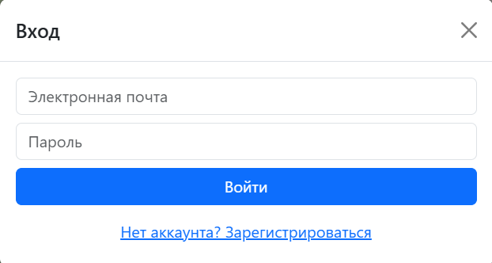
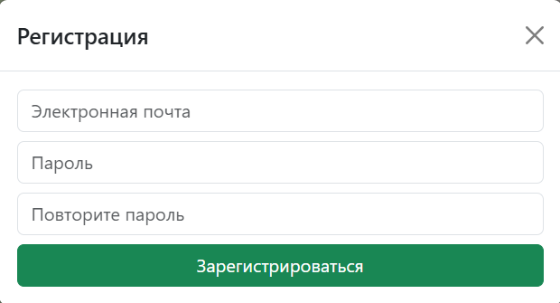
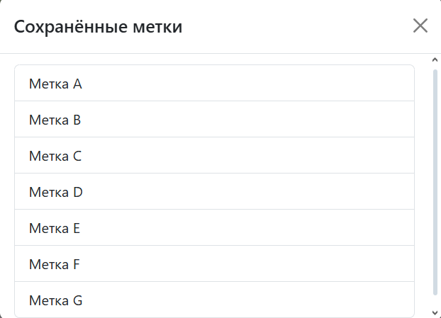
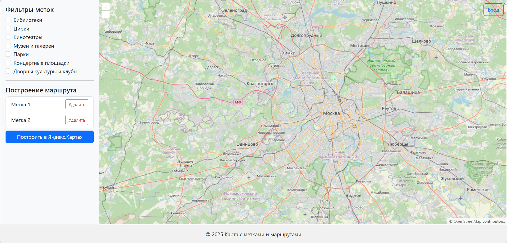

# Веб-карта памятников и достопримечательностей России 🇷🇺

## 🚀 Возможности

- Фильтрация меток по категориям.
- Авторизация, регистрация.
- Хранение сессии в jwt.
- Сохранение меток для авторизованных пользователей.
- Построение маршрутов с визуализацией и стрелками направления.
- Выбор типа передвижения для маршрута: автомобиль, пешком, велосипед.

## Ворк ин прогресс
-	Реализация роли администратора и панели управления, позволя-ющей добавить новые метки в соответствующие списки;
-	Реализация сохранения маршрутов для авторизованных пользова-телей;
-	Сохранение маршрутов для сессии;
-	Реализация верификации по электронной почте;
-	Реализация смены электронной почты, пароля;
-	Добавление возможности делиться маршрутами;
-	Реализация системы оценок для маршрутов и меток;
-	Реализация блокировки аккаунтов ролью администратора.

## 📷 Интерфейс

Верстка на Bootstrap

<table>
  <tr>
    <td align="center">
      <br/>
      <em>Окно входа</em>
    </td>
    <td align="center">
      <br/>
      <em>Окно регистрации</em>
    </td>
  </tr>
  <tr>
    <td align="center">
      <br/>
      <em>Окно сохраненных меток</em>
    </td>
    <td align="center">
      <br/>
      <em>Страница сайта и маршрут</em>
    </td>
  </tr>
</table>

## ⚙️ Установка

```bash
git clone https://github.com/Romenxek/Cursovaya.git
cd Cursovaya
npm install
```

Файл example.env заменить на .env
Убрать ".example" у конфиг файлов сервисов

## ⚙️ Запуск
```bash
npm server.js
```
